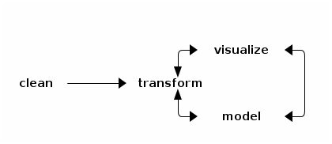

# Workflow for Epidemiological Data Analysis

We saw `R` is a powerful software for data analysis. Contrary to other softwares
which provide you with ready, fixed, *canned* procedures to perform statistical
analyses, R always let you have access to all computations' results. R can also be
extended with *packages*. About 6,000 of them are available via
[CRAN](http://cran.r-project.org/web/packages/). Furthermore, you can easily
create your own packages, or functions, to tackle your specific needs and/or
problems.

Specifically for epidemiologist, you could use the following packages for your
analyses:

- [Epi](http://cran.r-project.org/web/packages/Epi/index.html) (DAN)
- [epibasix](http://cran.r-project.org/web/packages/epibasix/index.html) (CAN)
- [epicalc](http://cran.r-project.org/web/packages/epicalc/index.html) (THA)
- [epiR](http://cran.r-project.org/web/packages/epiR/index.html) (NZE, vet)
- [epitools](http://cran.r-project.org/web/packages/epitools/index.html) (USA)
- [EpiContactTrace](http://cran.r-project.org/web/packages/EpiContactTrace/index.html) (SWE)
- [EpiEstim](http://cran.r-project.org/web/packages/EpiEstim/index.html) (UK)
- [EpiModel](http://cran.r-project.org/web/packages/EpiModel/index.html) (USA)

But before using these packages you might well go through these series of steps :
cleaning, transforming, visualizing, and modeling your data (from
[Hadley Wickham](http://vita.had.co.nz/papers/tidy-data-pres.pdf)).

But first in order to create, manipulate, and make some operations on your
data. You will work with [R objects](01-data-structures.html).

## Tidying Your Data

You will need to get your data in a certain format to be analyzed so that it is
easy to analyzed, visualize, and model. Three tools can help you in your task:
`reshape2`, `stringr`, and `plyr`.

[Data Tidying](02-tidy.html)

## Transforming Your Data

You will need to transform your data to get the output you want. Very often it
can be summarized like this: you split your data into the piece you're
interested in, apply a function on them, and then combine them back together.

[Apply family](03-apply-family.html)

## Visualizing Your Data

[Visualizing](04-visualize.html)

## Reproducible Research and Workflow

[Reproducible Research](05-RR.html)
