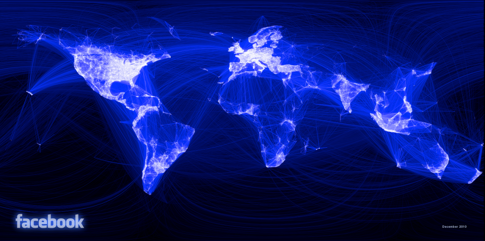

# Base Graphics

One of the best parts of R is its plotting capabilities. Take for example the
following graph
[visualizing Facebook friends](http://paulbutler.org/archives/visualizing-facebook-friends/),
[Napoleon's March to Moscow](http://www.datavis.ca/gallery/re-minard.php), or
this [wind map](http://hint.fm/wind/index.html).



\


Most model output has an associated `plot` method which allows one to quickly
visualize the results of an analysis using a consistent interface.

In this lesson, we will learn about base graphics, which is the oldest graphics
system in R. Higher-level graphics packages like
[`lattice`](https://www.springer.com/new+%26+forthcoming+titles+%28default%29/book/978-0-387-75968-5)
and `ggplot2` are also commonly used. `ggplot2` will be covered next.

We will use the [pig_adg](http://www.upei.ca/ver/datasets-programs) dataset from
the [VER](http://www.upei.ca/ver/welcome) book by Ian Dohoo et al. These are
data on growth performance and abattoir findings of pigs, studying the
inter-relationships among respiratory diseases (atrophic rhinitis and enzootic
pneumonia), ascarid levels and daily weight gain
([Bernardo, Dohoo, and Donald](http://www.ncbi.nlm.nih.gov/pmc/articles/PMC1255650/)). The
book website offers dataset in R format.


```r
temp <- tempfile()
download.file(
    "http://ic.upei.ca/ver/sites/ic.upei.ca.ver/files/ver2_data_R.zip", temp)
load(unz(temp, "ver2_data_R/pig_adg.rdata"))
unlink(temp)
```

Base graphics use `plot()` function to create a plot. The type of plot depends on
the `class` of arguments given. `plot(x, y)` will give a scatterplot but if `x` is
a factor, it will give a boxplot. You also have high-level functions like
`hist()` to create an histogram or `qqnorm()` to get a QQ-plot. You can provide
additional arguments like `type =` to define the type of plot (`p` for
points, `l` for line, ...), `main =` and `sub =` for title and subtitle, `xlab
=` and `ylab =` for axis labels.


```r
plot(adg ~ dtm, data = pig_adg)
```


```r
trend <- lm(adg ~ dtm, data = pig_adg)
```


```r
plot(adg ~ dtm, data = pig_adg)
abline(trend)
```


# ggplot2

[`ggplot2`](http://docs.ggplot2.org/current/index.html) provides you with the
flexibility to create a wide variety of sophisticated visualizations with little
code. `ggplot2` plots are more elegant than base graphics.


```r
library(ggplot2)
```

```
## Loading required package: methods
```

```r
qplot(dtm, adg, data = pig_adg, geom = "point")
```


The `qplot` function pretty much works like a drop-in-replacement for the `plot`
function in base R. But using it just as a replacement is gross injustice to
`ggplot2` which is capable of doing so much more. 

__gg__ is for __grammar of graphics__, coined by
[Leland Wilkinson](https://www.springer.com/statistics/computational+statistics/book/978-0-387-24544-7). What
is __grammar of graphics__? Let deconstruct the plot below.


```r
ggplot(pig_adg, aes(x = dtm, y = adg)) +
    geom_point(aes(color = factor(sex))) +
    geom_smooth(method = 'lm')
```


 There are two sets of elements in this plot:

__Aesthetics__

First, let us focus on the variables `dtm`, `adg` and `sex`. You can see from
the plot that we have mapped `dtm` to `x`, `adg` to `y` and the color of the
point to `sex`. These graphical properties `x`, `y` and `sex` that encode the
data on the plot are referred to as `aesthetics`. Some other aesthetics to
consider are `size`, `shape` etc.


```r
ggplot(pig_adg, aes(x = dtm, y = adg)) +
    geom_point(aes(color = factor(sex), size = ar)) +
    geom_smooth(method = 'lm')
```


__Geometries__

The second element to focus on are the visual elements you can see in the plot
itself. There are three distinct visual elements in this plot.

- point
- line
- ribbon

These actual graphical elements displayed in a plot are referred to as
`geometries`. Some other `geometries` you might be familiar with are `area`,
`bar`, `text`.

Another very useful way of thinking about this plot is in terms of `layers`. You
can think of a `layer` as consisting of `data`, a `mapping` of `aesthetics`, a
`geometry` to visually display, and sometimes additional parameters to customize
the display.

There are three layers in this plot. A `point` layer, a `line` layer and a
`ribbon` layer. `ggplot2` allows you to translate the `layer` exactly as you see
it in terms of the constituent elements.


```r
layer_point <- geom_point(
    mapping = aes(x = dtm, y = adg, color = factor(sex)),
    data = pig_adg,
    size = 3
)
ggplot() + layer_point
```


__Exercise__

Try to replicate the following plot shown below. You will have to create the
dichotomous variable `ar_g1` indicating the presence/absence of an atrophic
rhinitis score greater than 1. The cross represents the mean, whci is not
produced by default in boxplot. Hint to get it: see `stat_summary`.


```r
pig_adg$ar_g1 <- with(pig_adg, ifelse(ar > 1, 1, 0))
```


## Faceting

When dealing with multivariate data, we often want to display plots for specific
subsets of data, laid out in a panel. These plots are often referred to as
small-multiple plots. They are very useful in practice since you only need to
take your user through one of the plots in the panel, and leave them to
interpret the others in terms of that.

`ggplot2` supports small-multiple plots using the idea of `facets`. Let us
revisit our scatterplot of `dtm` vs `adg`. We can facet it by the variable `pn`
using `facet_wrap`.


```r
ggplot(pig_adg, aes(x = dtm, y = adg)) +
    geom_point(aes(color = factor(sex))) +
    geom_smooth(method = 'lm') +
    facet_wrap(~ pn)
```


Note how `ggplot2` automatically split the data into two subsets and even fitted
the regression lines by panel. The power of a grammar based approach shines
through best in such situations.

We can also facet across two variables using `facet_grid`


```r
ggplot(subset(pig_adg, farm < 5), aes(x = dtm, y = adg)) +
    geom_point() +
    geom_smooth(method = 'lm') +
    facet_grid(pn ~ farm)
```


