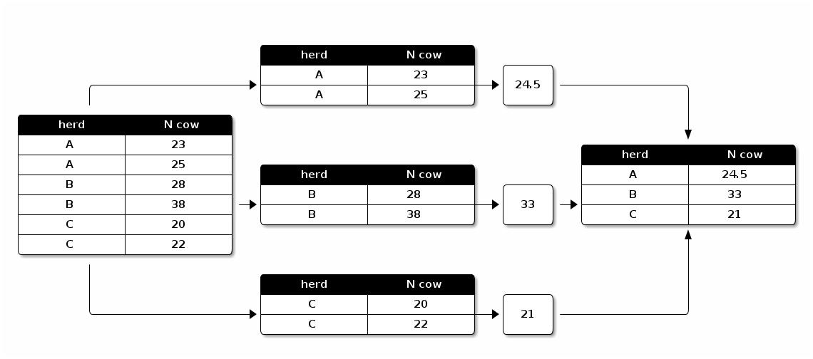

# Learning the apply family of functions

One of the greatest joys of vectorized operations is being able to use the
entire family of `apply` functions that are available in base `R`.

These include:

<pre class='in'><code>apply
by
lapply
tapply
sapply</code></pre>

## apply

`apply` applies a function to each row or column of a matrix. It's a convenient
way to get marginal values. It follows this syntax: `apply(object, dimension,
function)`.

<pre class='in'><code>m <- matrix(c(1:10, 11:20), nrow = 10, ncol = 2)
m</code></pre>

<pre class='out'><code>      [,1] [,2]
 [1,]    1   11
 [2,]    2   12
 [3,]    3   13
 [4,]    4   14
 [5,]    5   15
 [6,]    6   16
 [7,]    7   17
 [8,]    8   18
 [9,]    9   19
[10,]   10   20
</code></pre>

<pre class='in'><code># 1 is the row index
# 2 is the column index
apply(m, 1, sum)  # row totals</code></pre>

<pre class='out'><code> [1] 12 14 16 18 20 22 24 26 28 30
</code></pre>

<pre class='in'><code>apply(m, 2, sum)  # column totals</code></pre>

<pre class='out'><code>[1]  55 155
</code></pre>

<pre class='in'><code>apply(m, 1, mean)</code></pre>

<pre class='out'><code> [1]  6  7  8  9 10 11 12 13 14 15
</code></pre>

<pre class='in'><code>apply(m, 2, mean)</code></pre>

<pre class='out'><code>[1]  5.5 15.5
</code></pre>

There are convenience functions based on `apply`: `rowSums(x)`, `colSums(x)`,
`rowMeans(x)`, `colMeans(x)`, `addmargins`.

## by

`by` applies a function to subsets of a data frame.

<pre class='in'><code>by(prod.long$milk, prod.long[, "test"], summary)</code></pre>

<pre class='out'><code>prod.long[, "test"]: 1
   Min. 1st Qu.  Median    Mean 3rd Qu.    Max.    NA's 
  10.40   26.00   33.00   33.41   40.90   59.20     135 
-------------------------------------------------------- 
prod.long[, "test"]: 10
   Min. 1st Qu.  Median    Mean 3rd Qu.    Max.    NA's 
   5.20   16.50   21.60   21.78   25.90   45.30     332 
-------------------------------------------------------- 
prod.long[, "test"]: 2
   Min. 1st Qu.  Median    Mean 3rd Qu.    Max.    NA's 
   9.40   27.70   34.40   35.05   41.90   60.30     141 
-------------------------------------------------------- 
prod.long[, "test"]: 3
   Min. 1st Qu.  Median    Mean 3rd Qu.    Max.    NA's 
   3.80   25.20   32.00   32.86   39.00   64.50     158 
-------------------------------------------------------- 
prod.long[, "test"]: 4
   Min. 1st Qu.  Median    Mean 3rd Qu.    Max.    NA's 
  10.00   24.00   30.50   31.29   38.58   57.60     174 
-------------------------------------------------------- 
prod.long[, "test"]: 5
   Min. 1st Qu.  Median    Mean 3rd Qu.    Max.    NA's 
  10.10   22.10   29.80   29.74   36.10   54.20     199 
-------------------------------------------------------- 
prod.long[, "test"]: 6
   Min. 1st Qu.  Median    Mean 3rd Qu.    Max.    NA's 
  10.00   22.30   28.40   28.43   34.60   54.80     219 
-------------------------------------------------------- 
prod.long[, "test"]: 7
   Min. 1st Qu.  Median    Mean 3rd Qu.    Max.    NA's 
   9.70   20.22   26.55   26.71   32.70   52.50     234 
-------------------------------------------------------- 
prod.long[, "test"]: 8
   Min. 1st Qu.  Median    Mean 3rd Qu.    Max.    NA's 
   4.20   19.08   25.20   24.95   30.13   46.90     252 
-------------------------------------------------------- 
prod.long[, "test"]: 9
   Min. 1st Qu.  Median    Mean 3rd Qu.    Max.    NA's 
   5.00   18.20   23.00   23.10   27.05   45.50     285 
</code></pre>

### Exercise 1
Using `by`, what is the mean milk production for each monthly test? (use the
`prod.long` dataset)

### Solution

<pre class='in'><code>by(prod.long$milk, prod.long[, "test"], function(x) mean(x, na.rm = TRUE))</code></pre>

<pre class='out'><code>prod.long[, "test"]: 1
[1] 33.40822
-------------------------------------------------------- 
prod.long[, "test"]: 10
[1] 21.77976
-------------------------------------------------------- 
prod.long[, "test"]: 2
[1] 35.04708
-------------------------------------------------------- 
prod.long[, "test"]: 3
[1] 32.8617
-------------------------------------------------------- 
prod.long[, "test"]: 4
[1] 31.28558
-------------------------------------------------------- 
prod.long[, "test"]: 5
[1] 29.73588
-------------------------------------------------------- 
prod.long[, "test"]: 6
[1] 28.4306
-------------------------------------------------------- 
prod.long[, "test"]: 7
[1] 26.70865
-------------------------------------------------------- 
prod.long[, "test"]: 8
[1] 24.94637
-------------------------------------------------------- 
prod.long[, "test"]: 9
[1] 23.1
</code></pre>

## tapply

`tapply` applies a function to subsets of a vector.

<pre class='in'><code>tapply(health.wide$age, health.wide$lactation, mean)</code></pre>

<pre class='out'><code>        1         2         3         4         5         6         7 
 2.234899  3.372519  4.447423  5.574000  6.663043  7.457143  8.685714 
        8         9 
 9.825000 10.100000 
</code></pre>

`tapply()` returns an array; `by()`returns a list. 

## lapply (and llply)

What it does: Returns a list of same length as the input. 
Each element of the output is a result of applying a function to the
corresponding element.

<pre class='in'><code>my_list <- list(a = 1:10, b = 2:20)
my_list</code></pre>

<pre class='out'><code>$a
 [1]  1  2  3  4  5  6  7  8  9 10

$b
 [1]  2  3  4  5  6  7  8  9 10 11 12 13 14 15 16 17 18 19 20
</code></pre>

<pre class='in'><code>lapply(my_list, mean)</code></pre>

<pre class='out'><code>$a
[1] 5.5

$b
[1] 11
</code></pre>

## sapply

`sapply` is a more user friendly version of `lapply` and will return a list of
matrix where appropriate.

Let's work with the same list we just created.

<pre class='in'><code>my_list</code></pre>

<pre class='out'><code>$a
 [1]  1  2  3  4  5  6  7  8  9 10

$b
 [1]  2  3  4  5  6  7  8  9 10 11 12 13 14 15 16 17 18 19 20
</code></pre>

<pre class='in'><code>x <- sapply(my_list, mean)
x</code></pre>

<pre class='out'><code>   a    b 
 5.5 11.0 
</code></pre>

<pre class='in'><code>class(x)</code></pre>

<pre class='out'><code>[1] "numeric"
</code></pre>

## replicate

An extremely useful function to generate datasets for simulation purposes. 

<pre class='in'><code>replicate(10, rnorm(10))</code></pre>

<pre class='out'><code>            [,1]        [,2]        [,3]       [,4]        [,5]
 [1,] -0.3825285 -0.15049662  0.38901844 -1.1634208 -0.47896589
 [2,] -1.2224782 -1.32364719 -2.17280927 -0.9154476 -0.84531221
 [3,]  1.0374422  0.52958458 -1.25251725  1.2922039  1.30277280
 [4,]  0.4850371 -0.05288146 -0.36073702 -2.0572380 -0.87530927
 [5,] -0.6831718  0.99828390 -0.94361110 -0.1475951 -0.08923699
 [6,] -0.4935289  1.56597911  0.64880438 -1.9919463 -1.19038569
 [7,]  0.3182497 -0.19100380  0.08893411  1.0471156  1.51078832
 [8,]  0.3944179 -0.30467431  0.30919127 -0.4871586 -0.27297905
 [9,] -0.8765935 -0.69960802  0.36959642  1.0824069  0.18708743
[10,] -0.6470290  0.49547885 -1.06947931  0.3402216  0.31785455
             [,6]       [,7]       [,8]        [,9]       [,10]
 [1,] -0.51713224  1.1057275 -0.8016104 -2.13246235 -2.06097131
 [2,] -0.13160239  1.9643513  0.8936599  1.09957048 -0.02398695
 [3,]  2.06026467  1.8318046 -1.8882087 -1.44473269 -0.31963372
 [4,] -0.19832975 -2.3407156 -0.3147375 -0.26288677  2.05283934
 [5,] -0.39216534  0.3093236  0.7342018 -0.61889206 -0.45746891
 [6,] -0.03375015  0.5619868 -2.3627367  0.04239645  1.18102916
 [7,]  0.22983142 -1.7190631 -1.0305065 -2.01695685 -0.69525347
 [8,] -1.16265996  0.1568677 -1.2439022 -0.47840882  1.20459023
 [9,] -0.09364058 -1.6898980 -1.5229521 -2.10881994 -0.02985425
[10,]  0.12651834  1.2258497  1.6506443  0.32654385  0.27919528
</code></pre>

<pre class='in'><code>replicate(10, rnorm(10), simplify = TRUE)</code></pre>

<pre class='out'><code>             [,1]       [,2]        [,3]        [,4]        [,5]
 [1,]  0.21532660 -1.2139901  1.27533546  0.50469782 -0.31402143
 [2,]  0.07159233 -0.5490651  0.78607632 -0.20445991  1.31591264
 [3,] -0.84285864 -0.4463908 -1.47157164 -0.03352663 -0.07381336
 [4,]  0.30104217 -1.7143984  0.09714039  0.85697553  0.81983458
 [5,] -0.77943891  1.3506572 -0.85223818 -0.01877259  1.94572486
 [6,] -0.59264082 -0.6101494  0.28948520 -0.93769694  0.32632527
 [7,]  1.06111813 -1.9847355  0.33777711 -1.48530973  0.77209062
 [8,]  0.12360264  1.1675571  1.37584446  0.13636452  1.23498391
 [9,]  0.78380938  0.5435967  1.17265647  1.24079608 -0.95663607
[10,]  1.76230556 -0.1695249 -1.11997727  0.68431483 -0.37189229
            [,6]       [,7]       [,8]       [,9]       [,10]
 [1,]  0.3435102 -0.5519194 -1.4468220  1.7836163  0.80442819
 [2,] -0.7940568  0.4950202 -1.2353274 -0.6189973  0.12308133
 [3,]  1.2870927  0.5030508  1.2403990 -0.6358977 -2.03398795
 [4,] -1.0653873 -0.1649153 -0.1030459  0.2920181 -0.59928524
 [5,] -0.5416594  0.8448543  0.6994833  1.4987558  0.46259958
 [6,] -0.8268841  0.8531510  0.8927606  1.2150064 -0.80805707
 [7,]  1.2912449  0.8045406  0.1416868  1.2222159 -1.45437624
 [8,]  0.8688291  1.2726477  0.2637141 -0.7757005  2.42891645
 [9,] -0.9665802  0.2111594  0.6598173 -1.2515483 -0.87734596
[10,] -0.7294334 -0.8239659 -1.2237704 -0.3513476 -0.04919813
</code></pre>

The final arguments turns the result into a vector or matrix if possible.

## mapply
Its more or less a multivariate version of `sapply`. It applies a function to
all corresponding elements of each argument. 

example:

<pre class='in'><code>list_1 <- list(a = c(1:10), b = c(11:20))
list_1</code></pre>

<pre class='out'><code>$a
 [1]  1  2  3  4  5  6  7  8  9 10

$b
 [1] 11 12 13 14 15 16 17 18 19 20
</code></pre>

<pre class='in'><code>list_2 <- list(c = c(21:30), d = c(31:40))
list_2</code></pre>

<pre class='out'><code>$c
 [1] 21 22 23 24 25 26 27 28 29 30

$d
 [1] 31 32 33 34 35 36 37 38 39 40
</code></pre>

<pre class='in'><code>mapply(sum, list_1$a, list_1$b, list_2$c, list_2$d)</code></pre>

<pre class='out'><code> [1]  64  68  72  76  80  84  88  92  96 100
</code></pre>

---

* `apply` functions are more computationally efficient than loops
* you could also use `reshape2` and
  [`plyr`](http://plyr.had.co.nz/)/[`dplyr`](http://cran.rstudio.com/web/packages/dplyr/vignettes/introduction.html)
  packages

---

## aggregate

<pre class='in'><code>aggregate(age ~ lactation + da, data = health.wide, FUN = mean)</code></pre>

<pre class='out'><code>   lactation  da       age
1          1  No  2.235862
2          2  No  3.366667
3          3  No  4.417582
4          4  No  5.572917
5          5  No  6.668889
6          6  No  7.457143
7          7  No  8.816667
8          8  No  9.825000
9          9  No 10.100000
10         1 Yes  2.200000
11         2 Yes  3.750000
12         3 Yes  4.900000
13         4 Yes  5.600000
14         5 Yes  6.400000
15         7 Yes  7.900000
</code></pre>

## table

<pre class='in'><code>t1 <- table(health.wide$parity)
t1</code></pre>

<pre class='out'><code>
  1  2+ 
149 351 
</code></pre>

<pre class='in'><code>t2 <- table(health.wide$parity, health.wide$da)
t2</code></pre>

<pre class='out'><code>    
      No Yes
  1  145   4
  2+ 339  12
</code></pre>

<pre class='in'><code>prop.table(t1)</code></pre>

<pre class='out'><code>
    1    2+ 
0.298 0.702 
</code></pre>

<pre class='in'><code>prop.table(t2)</code></pre>

<pre class='out'><code>    
        No   Yes
  1  0.290 0.008
  2+ 0.678 0.024
</code></pre>

<pre class='in'><code>prop.table(t2, margin = 2)</code></pre>

<pre class='out'><code>    
            No       Yes
  1  0.2995868 0.2500000
  2+ 0.7004132 0.7500000
</code></pre>

See also `xtabs()`, `ftable()` or `CrossTable()` (in library `gmodels`).

### Exercise 2

From the lesson on `R` objects, you created a matrix based on the following:
Three hundred and thirty-three cows are milked by a milker wearing gloves and
280 by a milker not wearing gloves. Two hundred cows in each group developed a
mastitis. Using the `apply` family of functions, find out the risk ratio and
odds ratio for mastitis according to wearing gloves.

|           | Mastitis | No mastitis |
|:---------:|:--------:|:-----------:|
| Gloves    |: 200    :|: 133       :|
| No gloves |: 200    :|: 80        :|

### Solution

<pre class='in'><code>tab <- rbind(c(200, 133), c(200, 80))
rownames(tab) <- c("Gloves", "No gloves")
colnames(tab) <- c("Mastitis", "No mastitis")

row.tot <- apply(tab, 1, sum)
risk <- tab[, "Mastitis"] / row.tot
risk.ratio <- risk / risk[2]
odds <- risk / (1 - risk)
odds.ratio <- odds / odds[2]
rbind(risk, risk.ratio, odds, odds.ratio)</code></pre>

<pre class='out'><code>              Gloves No gloves
risk       0.6006006 0.7142857
risk.ratio 0.8408408 1.0000000
odds       1.5037594 2.5000000
odds.ratio 0.6015038 1.0000000
</code></pre>

---

## Split-Apply-Combine in Action

The following figure can give you a sense of what is split-apply-combine.

`plyr` package can be used to apply the split-apply-combine strategy. You need
to provide the following information:

1. The data structure of the input
2. The dataset being worked on
3. The variable to split the dataset on.
4. The function to apply to each split piece.
5. The data structure of the output to combine pieces.

In short, `plyr` synthetizes the entire `*apply` family. For example, the mean
age by herd and parity could be computed and saved into a data frame:

<pre class='in'><code>lact <- ddply(health.wide,
              .(herd, parity),
              summarize,
              mean.age = mean(age)
              )</code></pre>

Two other packages can also be helpful in applying this strategyL `dplyr` and
`data.table`.
